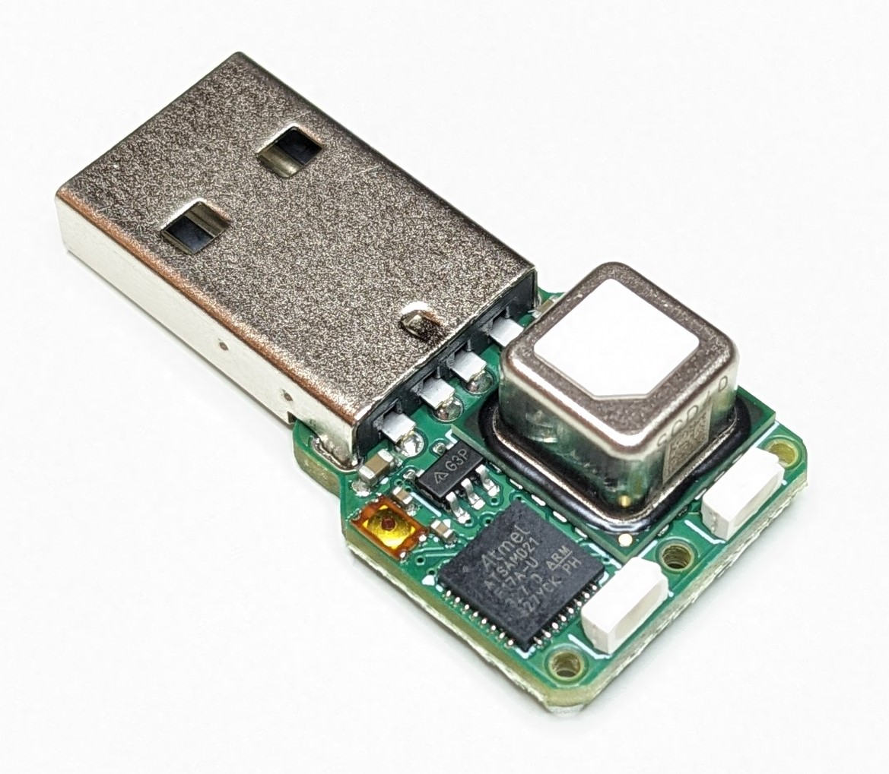

# MiniCO2

The MiniCO2 is a miniature USB-powered CO2 sensor that can be used 
anywhere you need a simple indicator of CO2. Its built-in LEDs light up green, orange, or red, depending on the 
amount of CO2 in the air. The default levels can be adjusted to suit your needs.

## Compatibility
The MiniCO2 works with any standard USB type A port that can supply power. That means it can be plugged in nearly 
anywhere: Laptops, displays, chargers, battery banks. 

## Repo status
The repository is a work in progress. Currently, only the KiCAD design files are provided. I intend to add:
 - Production files optimized for JLCPCB
 - CAD files for a 3D-printable enclosure
 - Firmware
 - Control application
 - Python example snippets on how to receive data

## Licenses
The MiniCO2 firmware is licensed under the GNU General Public License v3. The MiniCO2 hardware is licensed under 
CERN-OHL-S v2. This includes the PCB design files and enclosure design files. As an individual you are free to make your 
own MiniCO2, or to modify it, as long as these licenses are respected.
